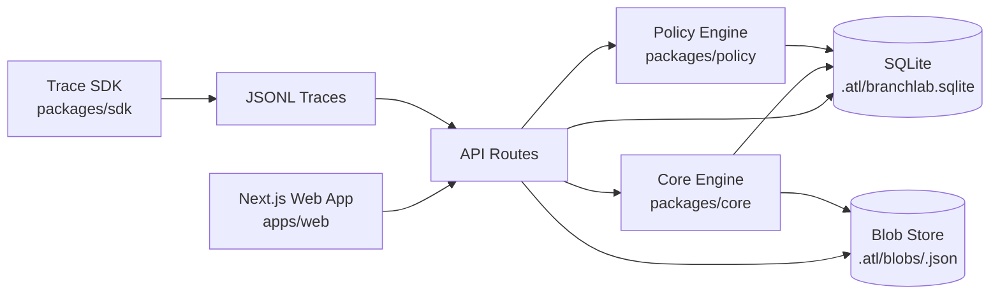
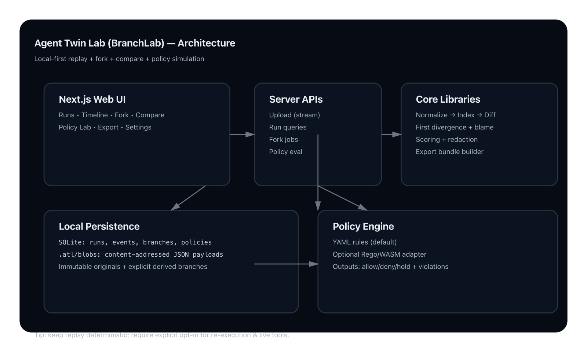
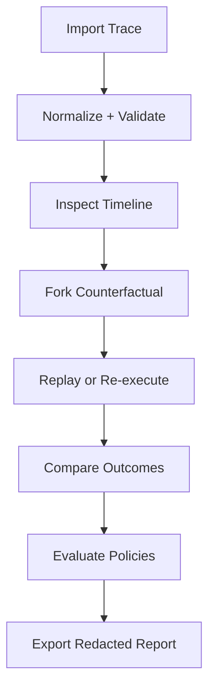

# BranchLab

```text
 ____                        _      _          _
| __ ) _ __ __ _ _ __   ___ | |__  | |    __ _| |__
|  _ \| '__/ _` | '_ \ / __|| '_ \ | |   / _` | '_ \
| |_) | | | (_| | | | | (__ | | | || |__| (_| | |_) |
|____/|_|  \__,_|_| |_|\___||_| |_||_____\__,_|_.__/

Agent Twin Lab: replay, fork, compare, and govern AI agent runs.
```

BranchLab is a local-first reliability and governance cockpit for AI agents. It turns traces into a "digital twin" so you can inspect exactly what happened, run counterfactual branches, test policy impact, and export evidence-grade reports.

## Status

BranchLab is an independent personal R&D project focused on agent reliability, counterfactual debugging, and governance workflows. It is intentionally presented as a high-quality reference implementation rather than a commercial product.

## Why BranchLab

- Deterministic replay for root-cause analysis.
- Counterfactual branching to prove what changed outcomes.
- Policy simulation before production rollouts.
- Security-first local workflow with redacted exports by default.

## What It Is Good For

- Debugging why an agent run failed, drifted, or incurred unexpected cost.
- Demonstrating that one intervention actually changed an outcome.
- Testing policy changes against real traces before rollout.
- Producing review-ready artifacts for engineering, product, and governance stakeholders.

## Product At A Glance

<p align="center">
  
  
  
</p>

## Two Reading Paths

### Non-Technical Path

Start here if you are a product leader, stakeholder, or reviewer.

1. [Non-Technical Overview](docs/NON_TECHNICAL_OVERVIEW.md)
2. [Demo Script](docs/DEMO_SCRIPT.md)
3. [Release Report](docs/RELEASE_REPORT.md)

### Technical Path

Start here if you are implementing, extending, or operating BranchLab.

1. [Onboarding Guide](docs/ONBOARDING.md)
2. [Architecture](docs/ARCHITECTURE.md)
3. [Technical Deep Dive](docs/TECHNICAL_DEEP_DIVE.md)
4. [API Contracts](docs/API_CONTRACTS.md)

## Architecture Overview



<p align="center">
  
</p>

## User Journey (Import To Decision)



## Core Capabilities

- Timeline replay with raw and rendered event inspection.
- Branching interventions: prompt edit, tool output override, memory removal, policy override.
- Compare view with first divergence, semantic diffs, cost/outcome deltas, and blame heuristics.
- Policy Lab with YAML and Rego/WASM paths.
- Background jobs with progress/cancel for import, policy evaluation, and export.
- Keyboard-first UX (`Cmd/Ctrl+K`, `?`, `J/K/Enter/F`) with accessibility checks.
- Local-first data persistence and export bundles (`report.html`, `run.json`, `diff.json`, `policy_results.json`).

## 5-Minute Quickstart

```bash
make setup
make dev
```

Open [http://localhost:3000](http://localhost:3000).

Seed demo runs:

```bash
make demo
```

## First 3-Minute Walkthrough

1. Open landing page and click **Try demo trace**.
2. Open run `run_demo_fail` and inspect summary + timeline.
3. Fork from `pricing.lookup` tool response.
4. Override output with corrected payload from [Demo Script](docs/DEMO_SCRIPT.md).
5. Compare parent vs branch and review the divergence + blame panel.
6. Open Policy Lab and run `examples/policies/block_network.yaml` on both runs.

## Local Quality Gates (No Paid CI Required)

```bash
make check
make e2e
make demo
make e2e-matrix
make preflight
```

`make preflight` includes lint, typecheck, unit tests, e2e flows, visual regression, matrix browser pass, perf budget, dependency audit, SAST, secret scan, and production smoke test.

## Security And Safety Defaults

- Trace payloads are treated as untrusted input.
- CSP and output encoding protections are enabled.
- No trace content is executed as code.
- Exports are redacted by default (explicit opt-out required).
- Re-execution is opt-in with provider configuration and live-tool allowlists.

## Documentation Map

- [Documentation Hub](docs/README.md)
- [Product Requirements](docs/PRD.md)
- [Architecture](docs/ARCHITECTURE.md)
- [Technical Deep Dive](docs/TECHNICAL_DEEP_DIVE.md)
- [Non-Technical Overview](docs/NON_TECHNICAL_OVERVIEW.md)
- [Onboarding Guide](docs/ONBOARDING.md)
- [Screenshot Gallery](docs/SCREENSHOT_GALLERY.md)
- [Release Checklist](docs/RELEASE_CHECKLIST.md)
- [Threat Model](docs/THREAT_MODEL.md)

## Repository Layout

```text
apps/web            Next.js app (UI + API routes)
packages/core       Trace model, parsing, branching, compare, blame, scoring
packages/policy     YAML policy backend + Rego/WASM path
packages/sdk        Trace instrumentation helpers
examples/           Sample traces and policies
docs/               Product, architecture, operations, and release documentation
assets/             Shared diagrams and illustrations
```

## Contributing

Please start with [CONTRIBUTING.md](CONTRIBUTING.md), then follow [docs/ONBOARDING.md](docs/ONBOARDING.md) for local workflows.

## License

MIT (see [LICENSE](LICENSE)).

---

Independent project notice: BranchLab is a personal R&D project by Jason Lovell. It is not a commercial product and is not affiliated with, endorsed by, or representing any employer, client, or partner organization.
