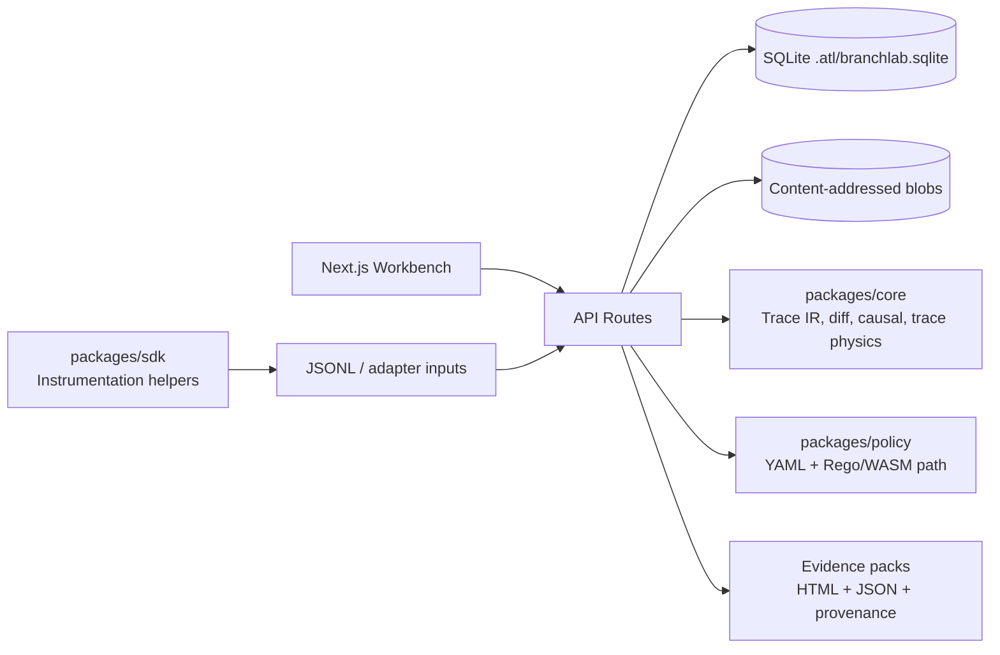

# BranchLab

**A local-first reliability lab for agent traces, counterfactual debugging, evals, policy simulation, runtime guardrails, and evidence packs.**

BranchLab is an open-source oriented R&D project for people who need to understand what an AI agent actually did. It turns traces into replayable evidence: normalized events, canonical Trace IR, deterministic fingerprints, causal comparisons, eval gates, policy-impact checks, reviewer annotations, and redacted export bundles.

It is intentionally not a SaaS dashboard. The design goal is a rigorous local workbench: simple core trace mathematics, explicit adapters at the edge, no magic without an artifact you can replay or export.

<p align="center">
  
</p>

<p align="center">
  
  
</p>

## Why It Exists

Modern agents fail in ways ordinary logs do not explain. A final answer can change because of a tool output, policy decision, prompt branch, hidden retry, model setting, or stale memory read. BranchLab makes those causal surfaces inspectable.

Use it to answer questions like:

- What was the first meaningful divergence between a failed run and a fixed branch?
- Which span is the strongest causal candidate for the outcome change?
- Would a proposed policy have blocked, held, or allowed this run?
- Did the branch improve an eval gate, or just move the failure somewhere else?
- What evidence can I hand to another engineer without exposing raw secrets?

## What BranchLab Does

| Lab | Purpose |
| --- | --- |
| **Workbench** | Local cockpit for import, Trace IR state, evidence stack, import telemetry, and guided first run. |
| **Runs** | Trace library with filters, annotations, tags, saved views, and event inspection. |
| **Compare** | Parent/branch diff with replay fingerprints, first divergence, semantic deltas, and trace-physics evidence. |
| **Causality** | Branch DAG, candidate ranking, selected-span reviewer notes, investigation ledger, resolve/reject workflow. |
| **Eval Lab** | Datasets from traces, deterministic rubric scoring, pairwise branch comparison, and regression gates. |
| **Policy Lab** | YAML/Rego policy simulation, PII/secrets detectors, dataflow warnings, tool-risk scoring, and impact summaries. |
| **Runtime Lab** | Guarded replay/re-exec records with budgets, provider state, live-tool allowlist evidence, and side-effect audit trails. |
| **Evidence Packs** | Redacted HTML/JSON bundles with normalized traces, Trace IR, causal diff, evals, policies, annotations, and provenance hashes. |

## Core Ideas

- **Trace IR v2 is the spine.** Every serious product surface is grounded in canonical span IDs, sequence numbers, hashes, parent links, causal parents, provider/model/tool metadata, usage, timing, redaction state, and policy metadata.
- **Replay artifacts beat stories.** BranchLab stores deterministic fingerprints, compact evidence summaries, and content-addressed payload blobs so comparisons can be checked later.
- **Adapters stay at the edge.** BranchLab can ingest normalized BranchLab JSONL, OTel GenAI-style spans, OpenAI/Anthropic-style envelopes, LangSmith-like exports, MLflow-like traces, and malformed generic JSONL as auditable notes.
- **Local-first is a feature.** Data lives under `.atl/` by default. Tests and benchmarks use isolated temp roots so local user data is not reset by automation.
- **Exports are evidence, not screenshots.** Evidence packs include redaction, provenance hashes, branch diffs, eval results, policy results, investigation ledgers, and span reviewer notes.

## Quickstart

Prerequisites:

- Node.js 20+
- pnpm 10+

```bash
make setup
make dev
```

Open [http://localhost:3000](http://localhost:3000).

Seed demo traces:

```bash
make demo
```

Run the local quality gate:

```bash
make check
make e2e
make e2e-matrix
```

## Five-Minute Demo

1. Seed the demo traces.
2. Open `run_demo_fail` in the run library.
3. Fork from the pricing tool response.
4. Override the tool output with the corrected payload from [docs/DEMO_SCRIPT.md](docs/DEMO_SCRIPT.md).
5. Compare parent vs branch and inspect the first divergence.
6. Open Causality, save an investigation, pin a span, and add a reviewer note.
7. Run an eval or policy impact check.
8. Export a redacted evidence pack.

## Architecture



Repository layout:

```text
apps/web        Next.js app, API routes, local SQLite persistence, Playwright tests
packages/core   Trace normalization, Trace IR v2, hashing, compare, causal analysis
packages/policy YAML policy backend and Rego/WASM integration path
packages/sdk    BranchLab JSONL and OTel-compatible instrumentation helpers
examples/       Demo traces, golden trace corpus, sample policies
docs/           Architecture, API contracts, threat model, release and UX docs
assets/         Shared diagrams and generated visual assets
```

## Trace And Evidence Model

BranchLab persists both the normalized v1 event stream and Trace IR v2 rows.

Key Trace IR fields include:

- `traceId`, `runId`, `spanId`, `parentSpanId`
- `sequence`, `eventKind`, `causalParentIds`
- `provider`, `model`, `toolCallId`
- `inputRef`, `outputRef`, `hash`, `redactionState`
- `timing`, `usage`, `policy`, `data`

Evidence packs can include:

- `report.html`
- `run.json`
- `trace_ir.json`
- `trace_physics.json`
- `investigations.json`
- `span_annotations.json`
- `diff.json`
- `causal_diff.json`
- `policy_results.json`
- `eval_results.json`
- `provenance.json`

See [docs/TRACE_FORMATS.md](docs/TRACE_FORMATS.md), [docs/DATA_MODEL.md](docs/DATA_MODEL.md), and [docs/API_CONTRACTS.md](docs/API_CONTRACTS.md).

## Security And Safety Defaults

- Trace payloads are treated as untrusted input.
- CSP and output encoding protections are tested.
- Export redaction covers common emails, phone numbers, and API-key patterns.
- Destructive reset paths are guarded so test runs cannot wipe the real default `.atl` data root by accident.
- Re-execution defaults to guarded records, explicit budgets, and disabled live tools unless allowlisted.
- SAST and secret scanning are part of the local release gate.

## Quality Gates

The current local release discipline is intentionally heavy for a local-first tool:

```bash
pnpm check
pnpm e2e
pnpm e2e:matrix
pnpm audit --prod --audit-level high
pnpm sast
pnpm scan:secrets
pnpm --filter @branchlab/web perf:budget
pnpm --filter @branchlab/web benchmark:suite
pnpm demo
pnpm smoke:prod
```

Latest verified status is tracked in [docs/FRONTIER_AUDIT.md](docs/FRONTIER_AUDIT.md), [docs/FRONTIER_BURNDOWN.md](docs/FRONTIER_BURNDOWN.md), and [.codex/PLANS.md](.codex/PLANS.md).

Known current caveat: the high-severity production dependency audit passes, but `pnpm audit` still reports 11 moderate advisories.

## Documentation

Start here:

- [docs/README.md](docs/README.md) - documentation hub by audience.
- [docs/FRONTIER_AUDIT.md](docs/FRONTIER_AUDIT.md) - current frontier-grade audit and residual risks.
- [docs/FRONTIER_BURNDOWN.md](docs/FRONTIER_BURNDOWN.md) - implementation burn-down.
- [docs/ARCHITECTURE.md](docs/ARCHITECTURE.md) - system architecture.
- [docs/TECHNICAL_DEEP_DIVE.md](docs/TECHNICAL_DEEP_DIVE.md) - engineering deep dive.
- [docs/THREAT_MODEL.md](docs/THREAT_MODEL.md) - security and privacy model.
- [docs/SCREENSHOT_GALLERY.md](docs/SCREENSHOT_GALLERY.md) - current UI screenshots.

## Contributing

Read [CONTRIBUTING.md](CONTRIBUTING.md), then use [docs/ONBOARDING.md](docs/ONBOARDING.md) for local setup and development workflow.

For larger work, keep an ExecPlan in `.codex/PLANS.md` and update it as the implementation evolves.

## License

MIT, see [LICENSE](LICENSE).

---

Independent project notice: BranchLab is a personal R&D project by Jason Lovell. It is not affiliated with, endorsed by, or representing any employer, client, or partner organization.
