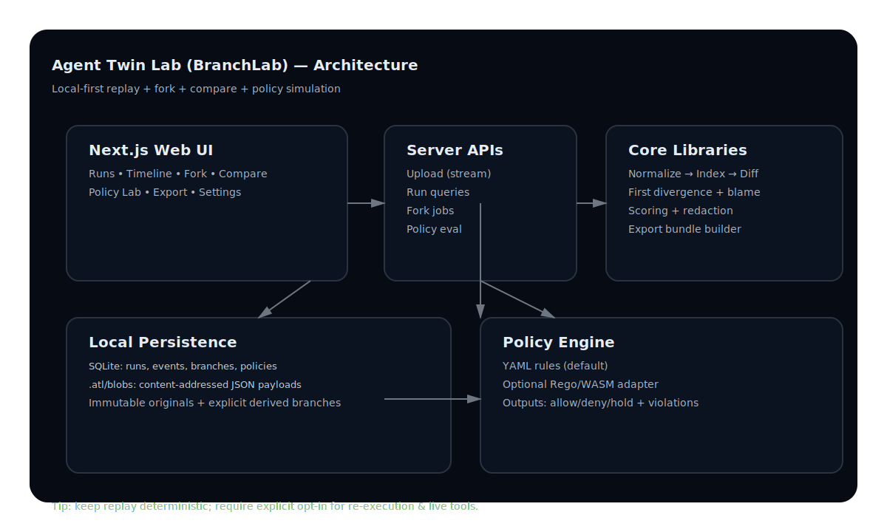

# Agent Twin Lab (BranchLab)

Replay, fork, and compare AI agent runs locally with deterministic evidence, policy impact simulation, and counterfactual debugging.

<p align="center">
  
</p>

## What this does

BranchLab treats an agent trace as a digital twin:
- replay exactly what happened
- fork at a step with structured interventions
- compare parent vs branch with divergence-aware diffs
- evaluate policy impact across runs
- export an internal report bundle (redacted by default)

## Core capabilities

- Deterministic replay with timeline + inspector (raw and rendered event views)
- Product shell UX:
  - command palette (`Cmd/Ctrl+K`)
  - keyboard help (`?`)
  - dark/light theme toggle
  - responsive mobile nav drawer
- Counterfactual branching:
  - prompt edit
  - tool output override
  - policy override
  - memory removal
- Compare view:
  - first divergence
  - changed event counts
  - semantic JSON diff
  - outcome/cost/policy deltas
- Blame suggestions (top candidates from trace heuristics)
- Policy Lab:
  - YAML rules backend
  - Rego/WASM backend (OPA-compatible)
- Background jobs for import/policy/export with progress + cancel APIs
- Saved run views, compare presets, run annotations, and branch templates
- Local-first persistence:
  - SQLite metadata
  - content-addressed blobs in `.atl/blobs/`
- Export bundle:
  - `report.html`
  - `run.json`
  - `diff.json`
  - `policy_results.json`

## Tech stack

- Next.js + TypeScript app: `apps/web`
- Core trace/diff/blame logic: `packages/core`
- Policy engine (YAML + Rego/WASM): `packages/policy`
- Trace instrumentation helpers: `packages/sdk`
- Monorepo orchestration: Turborepo + pnpm workspaces

## Quickstart

### 1) Install

```bash
make setup
```

### 2) Start app

```bash
make dev
```

Open: [http://localhost:3000](http://localhost:3000)

### 3) Seed demo traces

```bash
make demo
```

Then open `/runs` or click **Try demo trace (30 sec)**.

## Quality gates

### Standard gate

```bash
make check
make e2e
make demo
```

Optional cross-browser visual matrix:

```bash
make e2e-matrix
```

### Pre-release gate (full)

```bash
make preflight
```

This runs:
- lint + typecheck + unit tests
- browser e2e flow tests
- demo seed verification
- visual regression snapshots

No paid GitHub tooling is required for these gates; they run fully local.

## Optional dependency audit

```bash
make audit
```

## Data safety operations

```bash
make migrate-up
make migrate-status
make backup
make restore BACKUP=/absolute/path/to/.atl/backups/backup-...
make recover
```

## Release hardening commands

```bash
make perf-budget
make profile-harness
make benchmark-suite
make smoke-prod
make package-release
```

Artifacts are written under `artifacts/`.

## Project structure

```text
apps/web            Next.js app (UI + API routes)
packages/core       Trace model, parsing, branching, compare, blame, scoring
packages/policy     YAML policy backend + Rego/WASM support
packages/sdk        JSONL instrumentation helpers
examples/           Sample traces and policies
assets/             Architecture and UX diagrams
docs/               PRD/specs/acceptance/demo script
```

## Security notes

- Traces are treated as untrusted input.
- No trace payload is executed as code.
- CSP and hardening headers are set in `apps/web/next.config.ts`.
- Exports are redacted by default (opt-out is explicit and warned).
- Re-execution is explicit opt-in and provider-configured.
- Diagnostics bundle generation is opt-in only (Settings toggle).

## Rego/WASM note

Rego source compilation requires local `opa` and `tar` binaries for source-to-WASM compile paths.
YAML policies work out of the box.

## Demo script

See [docs/DEMO_SCRIPT.md](docs/DEMO_SCRIPT.md).

## Release docs

- [docs/RELEASE_PROCESS.md](docs/RELEASE_PROCESS.md)
- [docs/VERSIONING.md](docs/VERSIONING.md)
- [docs/ACCESSIBILITY_AUDIT.md](docs/ACCESSIBILITY_AUDIT.md)
- [docs/FRONTEND_STYLE_GUIDE.md](docs/FRONTEND_STYLE_GUIDE.md)
- [docs/FRONTEND_SCORECARD.md](docs/FRONTEND_SCORECARD.md)

## Architecture

<p align="center">
  
</p>

Details: [docs/ARCHITECTURE.md](docs/ARCHITECTURE.md)

## License

MIT (see [LICENSE](LICENSE)).
