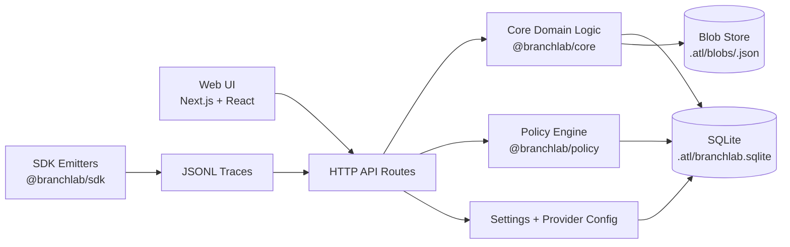
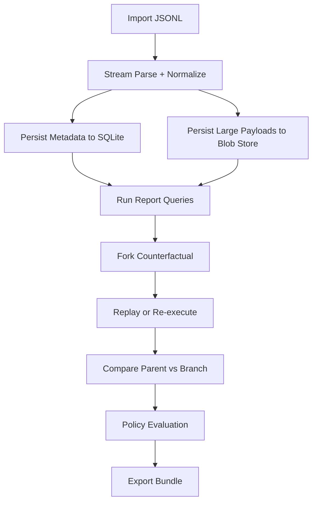

# BranchLab Architecture

## Executive Summary

BranchLab is a local-first system for replaying, branching, comparing, and governing AI agent traces.

Architecture priorities:
- deterministic replay as a hard default,
- safety-first re-execution controls,
- scalable local storage and query paths,
- evidence-quality outputs for cross-functional review.

## Topology

## End-to-End Data Flow

## Runtime Modes

### Replay Mode (Deterministic)

- No external model or tool calls.
- Branch behavior is computed from recorded data plus intervention overlays.
- Designed for reproducibility and high-confidence debugging.

### Re-execution Mode (Controlled)

- Model provider calls are enabled only when configured.
- Tool calls are stubbed by default.
- Live tool calls require explicit allowlist.
- Guardrails enforce call/token/cost limits.

## Storage Model

BranchLab stores data in `.atl/`:

- `branchlab.sqlite`: run metadata, event indexes, settings, policy and export records.
- `blobs/<sha256>.json`: large event payloads and artifacts by content hash.

Design intent:
- fast indexed filtering and timelines in SQLite,
- low duplication and bounded DB growth via blob indirection.

## Service Boundaries

- Ingestion: parse, validate, normalize, persist, and report warnings.
- Run Viewer: run summaries, event windows, paired request/response joins.
- Branching: intervention validation plus replay/re-exec execution.
- Compare: divergence detection, semantic diffing, delta summaries, blame heuristics.
- Policy: YAML and Rego/WASM evaluation with impact analytics.
- Export: report bundle generation with redaction defaults.

## Security And Trust Controls

- Trace payloads are untrusted by default.
- Rendered data is encoded and never executed as script.
- CSP safeguards are enabled.
- Export redaction defaults to on, with explicit opt-out warnings.
- Diagnostics bundle generation is explicit opt-in.

## Performance Strategy

- Streaming ingestion for large traces.
- Virtualized UI surfaces for high event counts.
- Derived indexes for timeline slicing and joins.
- Local perf budget gates to prevent regressions.

## References

- [TECHNICAL_DEEP_DIVE.md](TECHNICAL_DEEP_DIVE.md)
- [DATA_MODEL.md](DATA_MODEL.md)
- [TRACE_FORMATS.md](TRACE_FORMATS.md)
- [COUNTERFACTUALS.md](COUNTERFACTUALS.md)
- [POLICY_ENGINE.md](POLICY_ENGINE.md)
- [API_CONTRACTS.md](API_CONTRACTS.md)
