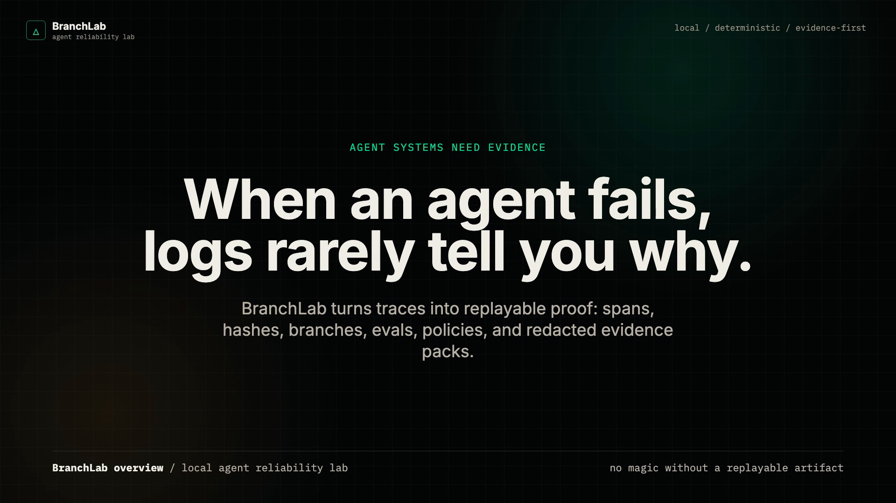
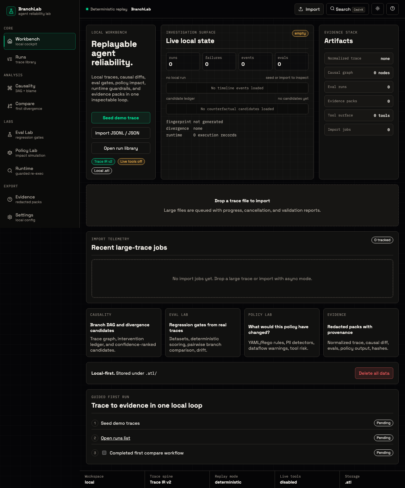
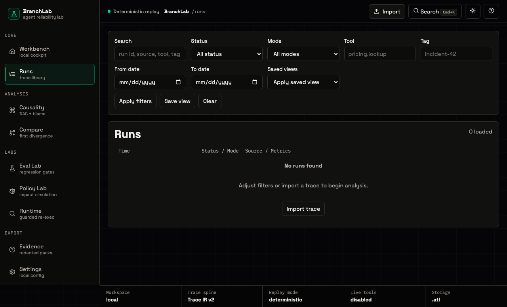
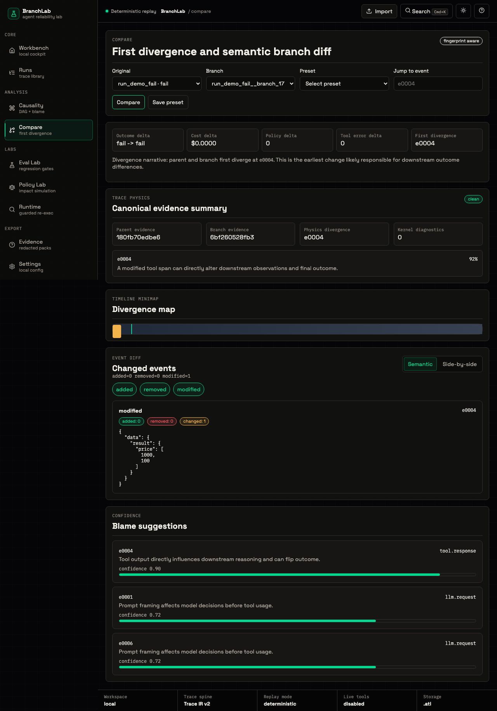

# BranchLab Screenshot Gallery

Screenshots are generated from the deterministic visual regression suite so the README and docs reflect the current verified UI.

## Overview Video

[Watch the 90-second BranchLab overview](assets/videos/branchlab-overview.mp4).

[](assets/videos/branchlab-overview.mp4)

## Workbench



## Run Library



## Compare And Trace Physics



## Regeneration

- Canonical source snapshots live in `apps/web/tests/e2e/visual-regression.spec.ts-snapshots/`.
- Refresh docs screenshots from the Darwin baseline after a verified UI update:
  ```bash
  cp apps/web/tests/e2e/visual-regression.spec.ts-snapshots/landing-darwin.png docs/assets/screenshots/landing.png
  cp apps/web/tests/e2e/visual-regression.spec.ts-snapshots/runs-darwin.png docs/assets/screenshots/runs.png
  cp apps/web/tests/e2e/visual-regression.spec.ts-snapshots/compare-darwin.png docs/assets/screenshots/compare.png
  ```
- Then run `make e2e-visual` and `make e2e-matrix`.
