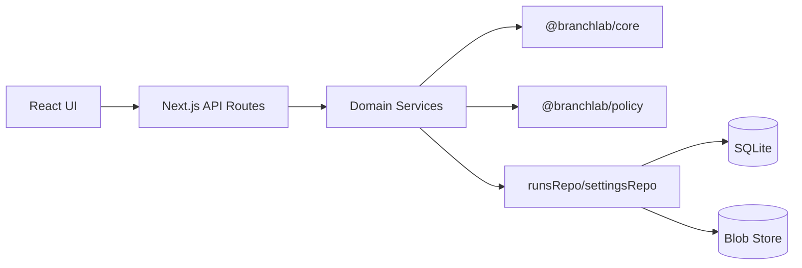
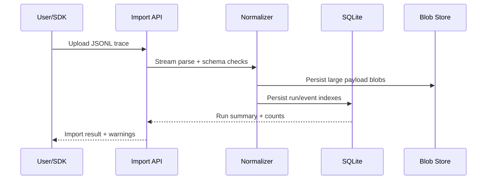

# BranchLab Technical Deep Dive

## Scope

This document explains how BranchLab is built, how data flows through the system, and what guarantees the platform provides.

For the high-level architecture diagram and summary, see [ARCHITECTURE.md](ARCHITECTURE.md).

## System Components

- `apps/web`: Next.js app containing UI and HTTP API routes.
- `packages/core`: trace normalization, replay branch overlays, diffs, blame heuristics, scoring.
- `packages/policy`: YAML evaluator and Rego/WASM execution path.
- `packages/sdk`: event emitters and instrumentation helpers.

## Runtime Boundaries



## Persistence Model

BranchLab uses local storage under `.atl/`:
- `.atl/branchlab.sqlite`: indexed metadata and relational records.
- `.atl/blobs/<sha256>.json`: content-addressed large payloads.

This split keeps hot query paths fast while avoiding oversized row payloads.

## Ingestion Pipeline



Key properties:
- streaming parser for large traces,
- adapter-based normalization,
- partial-parse behavior with actionable validation reports.

## Branch Execution Modes

### Replay (deterministic)

- No external calls.
- Applies intervention overlay to recorded event stream.
- Repeat runs with same input produce stable outputs.

### Re-execution (controlled non-deterministic)

- Provider-backed model calls are allowed when configured.
- Tool calls are stubbed by default.
- Live tool calls require explicit allowlist.
- Spend guardrails enforce max call/token/cost thresholds.

## Compare Engine

Compare computes:
- first divergence,
- event-level added/removed/modified classes,
- semantic JSON diff summaries,
- outcome and cost deltas,
- blame candidates with confidence/rationale.

See core implementation references:
- `packages/core/src/diff.ts`
- `packages/core/src/blame.ts`
- `apps/web/lib/compareService.ts`

## Policy Engine

Two backends are available:
- YAML rule evaluator (default path for quick authoring).
- Rego/WASM evaluator (OPA-compatible) for policy parity and stronger governance workflows.

Policy evaluations are tracked and surfaced through impact summaries in Policy Lab.

## HTTP Surface

See canonical request/response contracts in [API_CONTRACTS.md](API_CONTRACTS.md).

Primary routes:
- `/api/runs/import`
- `/api/runs`, `/api/runs/:runId`, `/api/runs/:runId/events`
- `/api/branches`, `/api/compare`
- `/api/policies`, `/api/policy-evals`
- `/api/export`
- `/api/settings`

## Security Model

- Trace content is untrusted.
- No dynamic code execution from trace payloads.
- CSP + encoding safeguards protect rendered surfaces.
- Secret scan and SAST checks are included in release preflight.

References:
- [THREAT_MODEL.md](THREAT_MODEL.md)
- [SECURITY_PRIVACY.md](SECURITY_PRIVACY.md)

## Verification And Release Gates

Minimum release bar:

```bash
make check
make e2e
make demo
make e2e-matrix
make preflight
```

`make preflight` is the authoritative local gate and does not depend on paid GitHub features.
